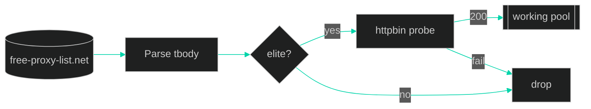

<div align="center">


<a href="https://git.io/typing-svg">
  
</a>

<br/>

### ⟡ Live telemetry ⟡

[](https://github.com/AbdulWajid768/free_proxies/stargazers)
[](https://github.com/AbdulWajid768/free_proxies/network/members)
[](https://github.com/AbdulWajid768/free_proxies/issues)

[](https://github.com/AbdulWajid768/free_proxies/commits/main)
[](https://github.com/AbdulWajid768/free_proxies/graphs/commit-activity)
[](https://github.com/AbdulWajid768/free_proxies)

[](https://www.python.org/)
[](https://www.crummy.com/software/BeautifulSoup/)

<br/>


<br/><br/>

[⚙ Setup](#-setup) · [🖥 CLI](#-cli) · [🧩 API](#-api)


</div>

---

## ◈ Transmission

**FreeProxy** pulls **elite** proxies from [free-proxy-list.net](https://free-proxy-list.net/), stress-tests each against `https://httpbin.org/ip`, and returns **`host:port`** strings that still respond.

> ⚠ **Warning:** Public proxies are **untrusted** and ephemeral—research, scraping labs, and QA only. Never route credentials or PII.

---

## ◈ Setup

```bash
git clone https://github.com/AbdulWajid768/free_proxies.git
cd free_proxies

pip install -r requirements.txt
python app.py
```

---

## ◈ CLI

```bash
python app.py
```

```text
Available Proxies: ['203.0.113.10:8080', ...]
Working Proxies:   ['203.0.113.10:8080']
```

---

## ◈ API

```python
from free_proxy import FreeProxy

proxies = FreeProxy.get_proxies()              # elite scrape
ok = FreeProxy.is_proxy_working("1.2.3.4:8080")  # 5s timeout probe
live = FreeProxy.get_working_proxies()         # scrape + filter
```

| Method | Output |
| --- | --- |
| `get_proxies()` | Unverified elite list |
| `is_proxy_working(proxy)` | `bool` |
| `get_working_proxies()` | Verified subset |

---

## ◈ Pipeline



---

<div align="center">

<a href="https://star-history.com/#AbdulWajid768/free_proxies&Date">
  <picture>
    <source media="(prefers-color-scheme: dark)" srcset="https://api.star-history.com/svg?repos=AbdulWajid768/free_proxies&type=Date&theme=dark"/>
    
  </picture>
</a>

<br/><br/>

**[Abdul Wajid](https://github.com/AbdulWajid768)** · Software Engineer · Lahore, PK

[](https://github.com/AbdulWajid768)


<sub>Scan the grid · Route through survivors.</sub>

</div>
