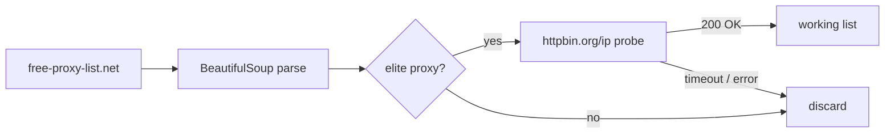

<div align="center">

```
╔══════════════════════════════════════════════════════════════════╗
║  ░▒▓  FREEPROXY  ▓▒░                                              ║
║  Elite proxy discovery · live health checks · zero config CLI     ║
╚══════════════════════════════════════════════════════════════════╝
```

[](https://www.python.org/)
[](https://requests.readthedocs.io/)
[](LICENSE)

**Scrape elite proxies from the public list. Probe them. Keep only what responds.**

[Setup](#-setup) · [API](#-api) · [CLI](#-cli)

</div>

---

## ◈ Signal

Need rotating egress for scraping, QA, or network experiments? **FreeProxy** pulls **elite** entries from [free-proxy-list.net](https://free-proxy-list.net/), validates each against `https://httpbin.org/ip`, and returns a clean list of working `host:port` strings.

Lightweight. Scriptable. No API keys.

> **Note:** Free proxies are unstable and untrusted—use for dev/research only, never for sensitive traffic.

---

## ◈ Setup

```bash
git clone https://github.com/AbdulWajid768/free_proxies.git
cd free_proxies

pip install -r requirements.txt
python app.py
```

---

## ◈ CLI

```bash
python app.py
```

Prints working proxies after filtering the scraped elite pool:

```text
Available Proxies: ['103.x.x.x:8080', ...]
Working Proxies: ['103.x.x.x:8080']
```

---

## ◈ API

```python
from free_proxy import FreeProxy

# All elite proxies from the list (unverified)
proxies = FreeProxy.get_proxies()

# Single health check (5s timeout, httpbin IP echo)
ok = FreeProxy.is_proxy_working("203.0.113.10:8080")

# Scrape + verify in one call
working = FreeProxy.get_working_proxies()
```

| Method | Returns |
| --- | --- |
| `get_proxies()` | `list[str]` — elite rows only |
| `is_proxy_working(proxy)` | `bool` |
| `get_working_proxies()` | `list[str]` — verified subset |

---

## ◈ Pipeline



---

## ◈ Maintainer

**[Abdul Wajid](https://github.com/AbdulWajid768)** · Software Engineer · Lahore, PK

[](https://github.com/AbdulWajid768)

---

<div align="center">

<sub>Scan the grid. Route through what survives.</sub>

</div>
